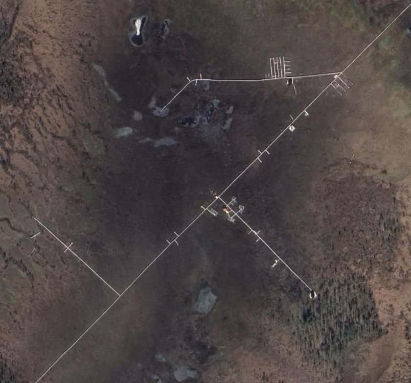
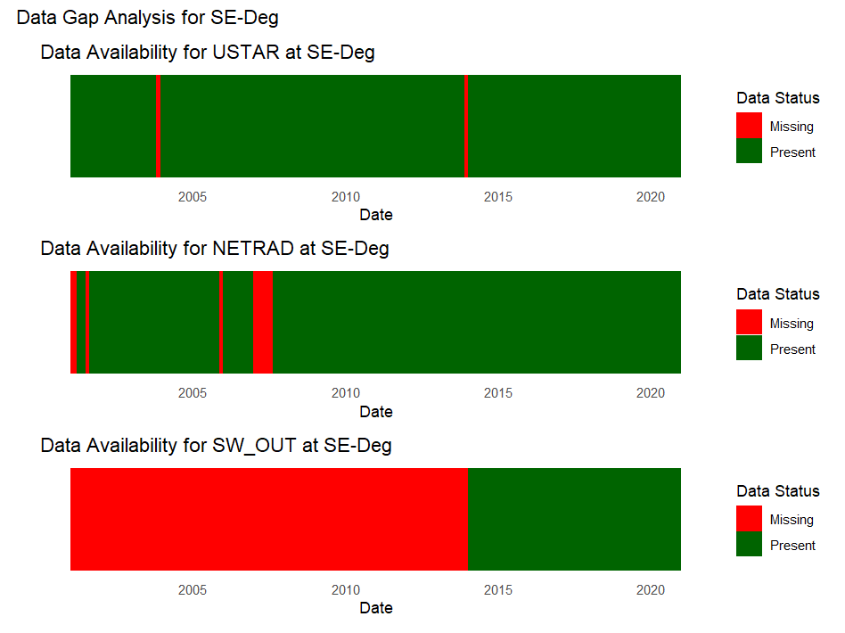
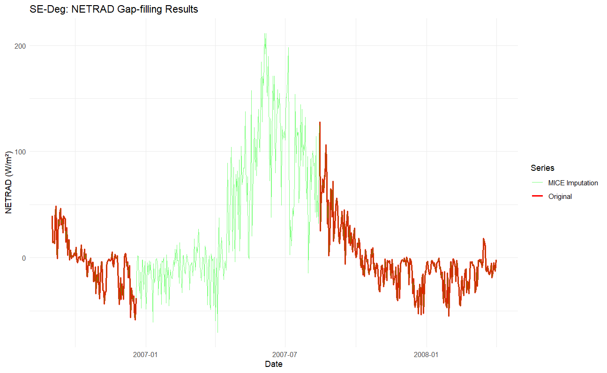
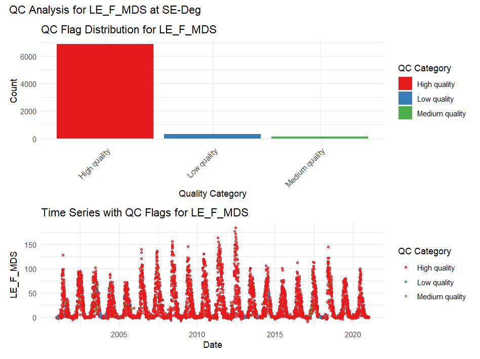
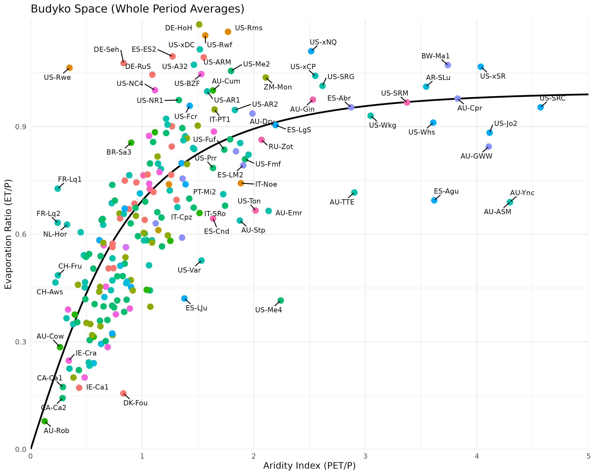
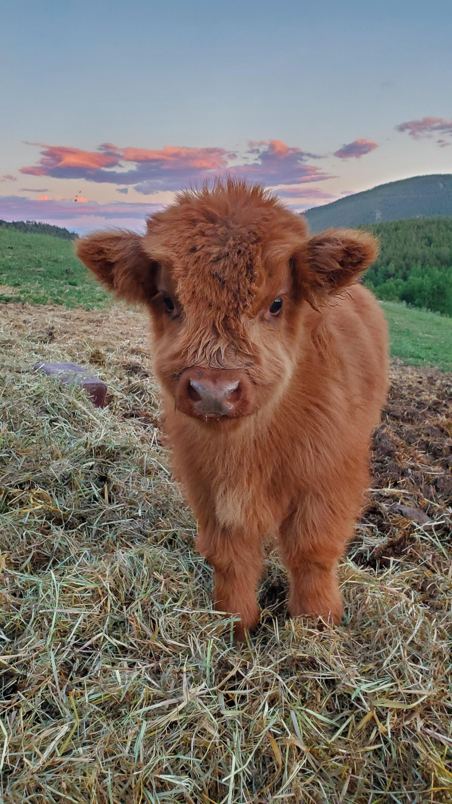
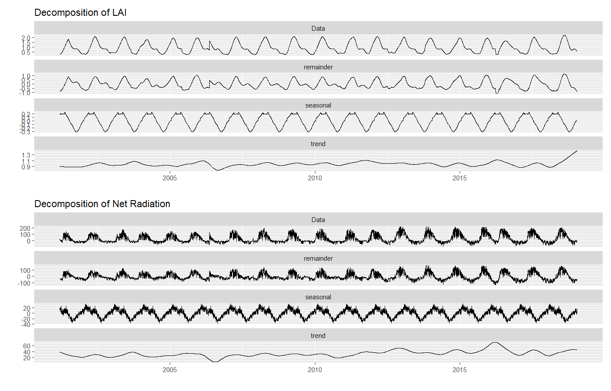
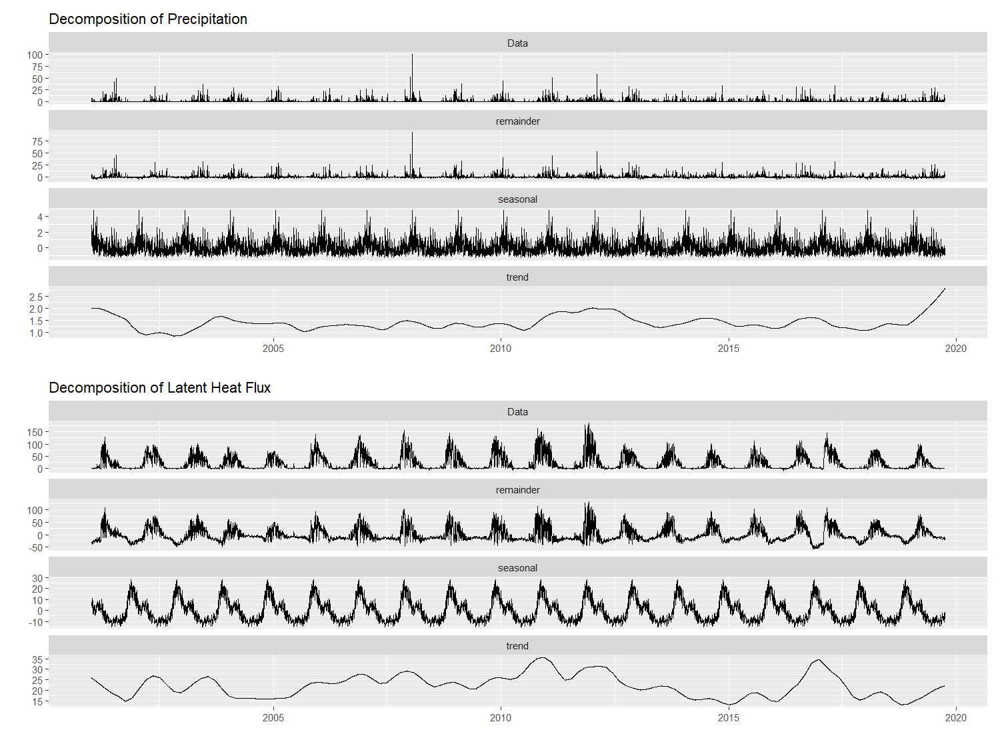
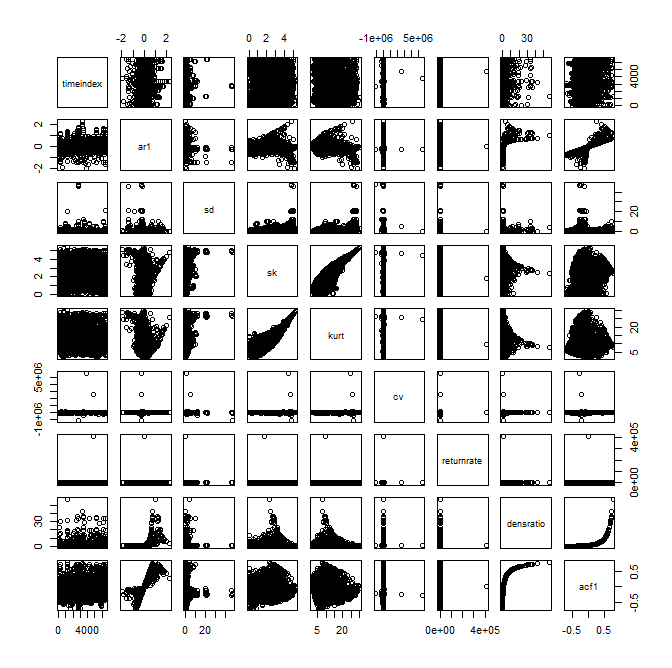

<style>
title {
  color: red;
}

h1 {
  color:rgb(48, 48, 109);
}
</style>

### Data Science for Sustainable Development

# Ecosystem-water interactions at Flux sites

Vajira Lasantha


---
## Flux towers

Measure exchange of $CO_2$, water vapour and energy between atmosphere and land using eddy covariance techniques.


---
## What I did:
- Obtain a compiled dataset of corrected flux data from multiple networks
- Check data coverage and quality
- 

---
## Data
[**FluxdataKit**](https://zenodo.org/records/14808331)
- Time series (half-hour and daily) data from 339 flux sites.
- Supplemented with remote sensing vegetation data (MODIS LAI and fAPAR)
- Varying temporal coverage
- Available as netCDF or CSV

---
## Data coverage

- [Locations of flux sites](flux_sites_map.html)
- Varying temporal coverage


---
## Data Cleaning

Check for missing data in key variables.


---


---

<style scoped>
p { text-align: center; }
</style>

## A closer look at individual sites
Example: **SE-Deg** near Umea, Sweden



---

## Fancy gap filling tools !
<style scoped>
p { text-align: center; }
</style>



---
## QC flags

 

---

## Mapping the sites in Budykyo space
Budyko Curve describes the theoretical energy
and water limits on the **catchment** water balance. It depicts the expected partitioning of P into ET and Q.


---

### Calculating potential evapotraspiration (PET)

Mutiple empirical functions such as Penman-Monteith, Priestly-Taylor, Hargreves, Thornthwaite.

Wrapper function to calculate PET with different methods:
```R
calculate_pet <- function(method = "priestley_taylor", ...) {
  switch(method,
         "priestley_taylor" = calculate_pet_priestley_taylor(...),
         "penman_monteith" = calculate_pet_penman_monteith(...),
         "hargreaves" = calculate_pet_hargreaves(...),
         "thornthwaite" = calculate_pet_thornthwaite(...),
         stop("Unknown method. Choose from: priestley_taylor, penman_monteith, hargreaves, thornthwaite")
  )
}
```

---


---

Is there a distiction between climates ?


---

How about land use ?



---

Root zone storage capacity


---


---
<!-- _class: lead -->



---

## Time Series Analysis
<style scoped>
p { text-align: center; }
</style>


---

## Time Series Analysis
<style scoped>
p { text-align: center; }
</style>


---
## Resilience Indicators

For the site **FI-Var** in Finnish Lapland during 2016-2020


---

# Main learnings

- Transparent quality assessment
- Some useful R packages like `purr`, `mice`
- Custom functions and packages in R
- R just works (mostly)